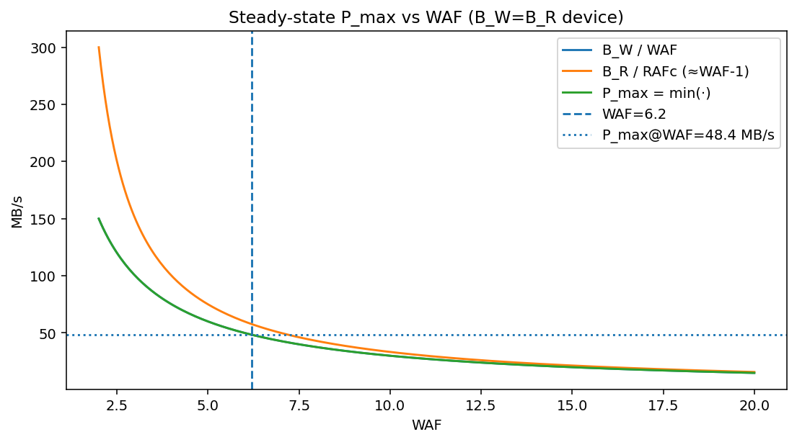
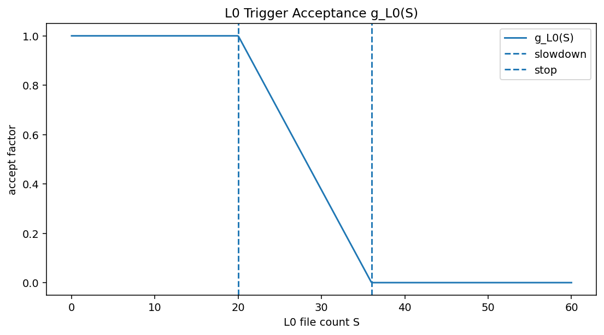
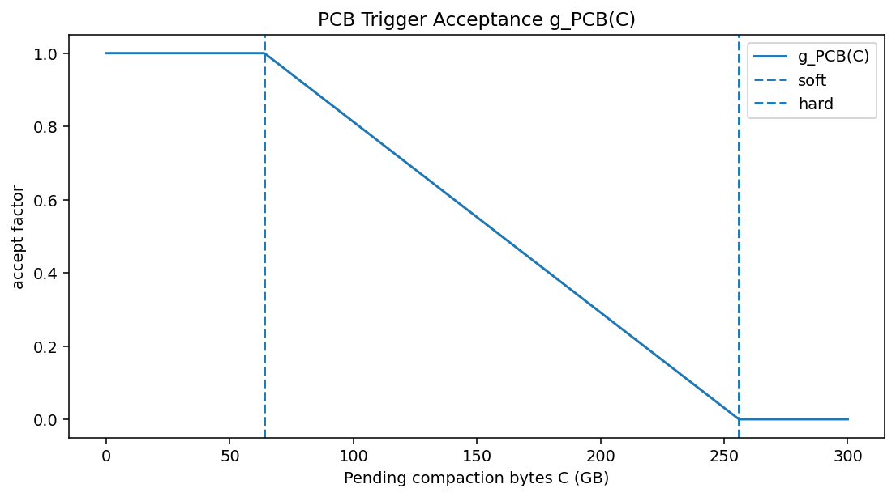
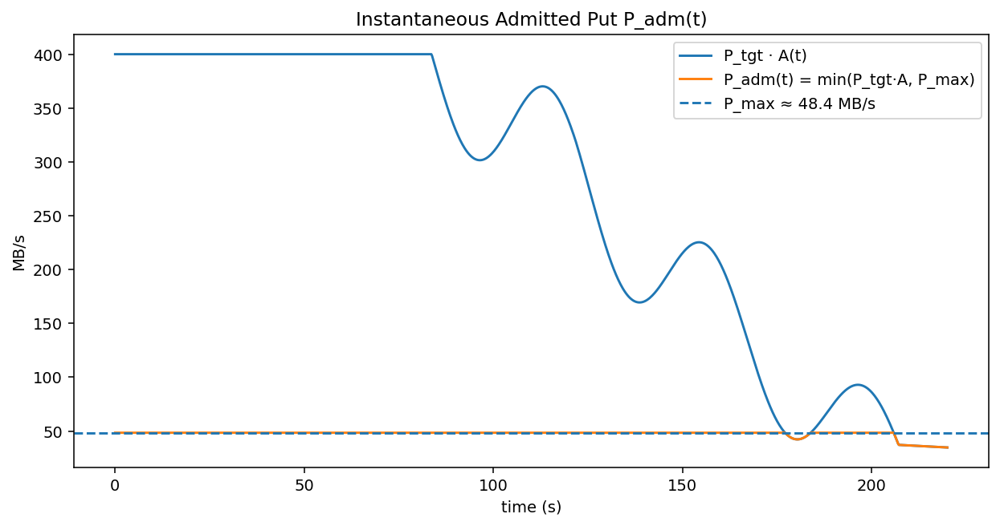
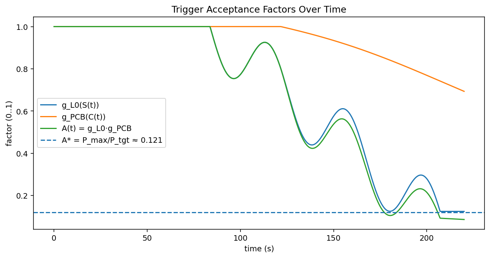
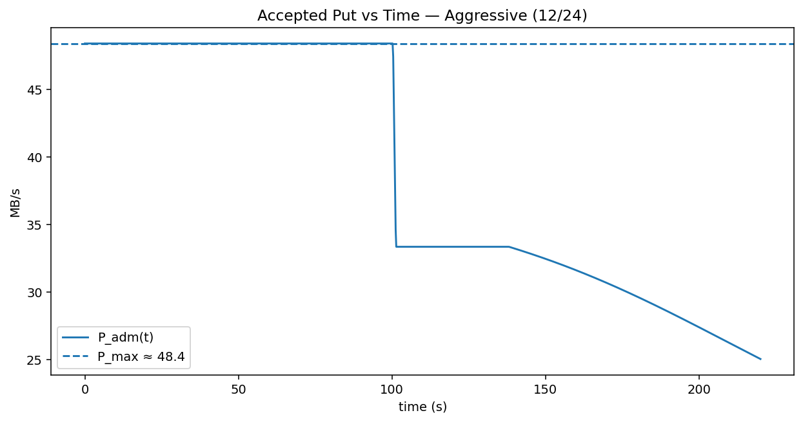
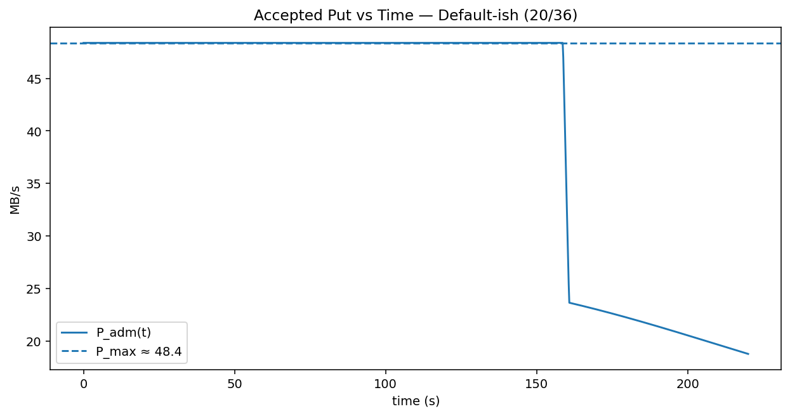
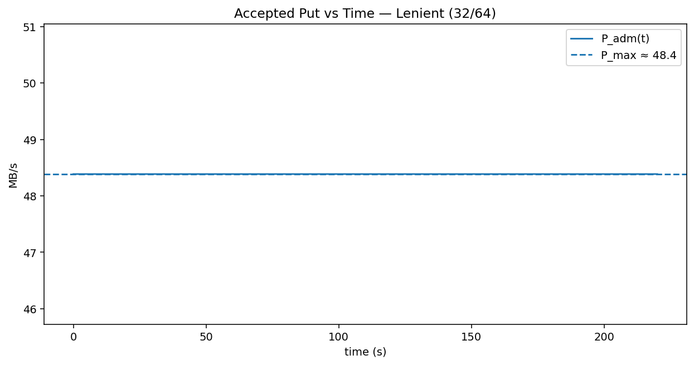

# RocksDB Compaction — End-to-End 분석 보고서 (재작성·보강판)

<style>
.math { 
  font-size: 120%; 
}
.math-display { 
  font-size: 130%; 
}
img { 
  max-width: 100%; 
  height: auto; 
  display: block; 
  margin: 10px auto; 
  border: 1px solid #ddd; 
  border-radius: 4px; 
  padding: 5px; 
  box-shadow: 0 2px 4px rgba(0,0,0,0.1);
}
table {
  border-collapse: collapse;
  width: 100%;
  margin: 10px auto;
}
table th, table td {
  border: 1px solid #ddd;
  padding: 8px;
  text-align: left;
}
table th {
  background-color: #f2f2f2;
  font-weight: bold;
}
</style>

_Date:_ 2025-08-29  
_Assumptions:_ Leveled compaction, 단일 SSD (실효 R/W BW = **300 MB/s**), 트리거: **L0=20/36**, **PCB=64/256 GB**  
_Calibration (예시):_ **WAF≈6.2**, **RAFc≈5.2** (운영에서는 반드시 **실측치**로 대체)  
_File layout:_ 이 MD와 모든 그림 PNG 및 CSV 파일이 **같은 디렉토리**에 있다고 가정

---

## 0. 용어·표기 (Glossary & Notation)

- **LSM-Tree**: Log-Structured Merge-Tree. 쓰기는 메모리(**MemTable**)에 누적하고 **flush**로 디스크 **SSTable(SST)**을 만든 뒤, 레벨(**L0~Lₙ**) **compaction(병합)**으로 정렬/비중복 유지.
- **MemTable**: 메모리상의 가변 테이블. 가득 차면 **flush → L0 SST**.
- **SST(SSTable)**: 불변(immutable) 정렬 파일. **L0**은 범위 겹침 허용, **L1+**는 비중복.
- **Compaction**: 상/하위 레벨 파일을 병합해 정렬 유지·중복제거·삭제 처리(백그라운드 **읽기+쓰기** I/O 소비).
- **Leveled compaction**: 레벨별 목표 용량을 유지하며 상위→하위로 데이터가 흘러가는 전형적 정책.
- **WAF (Write Amplification)**: `(user + compaction_write) / user`. 유저 1을 쓰기 위해 디스크에 실제 쓰인 총 바이트 배수.
- **RAFc (Compaction Read Amp)**: `compaction_read / user`. 컴팩션이 유발한 읽기 바이트 배수 (**Leveled**에선 보통 `RAFc ≈ WAF − 1`).
- **B_W, B_R (effective BW)**: 포그라운드 예약을 제외한 장치의 **실효** 쓰기/읽기 대역폭(MB/s).
- **P_tgt**: 애플리케이션이 의도하는 **목표 put** 속도(MB/s).
- **P_max**: 증폭과 대역폭으로 결정되는 **안정 put 상한**.
- **PCB (Pending Compaction Bytes)**: 처리 대기 중인 컴팩션 바이트(백로그). **soft/hard** 임계로 백프레셔 제어.
- **L0 slowdown/stop**: L0 파일 개수 임계(예: **20/36**). 구간별 **선형 감속**→**정지**.
- **A(t) (acceptance factor)**: 즉시 수용 계수(0~1). `A(t) = g_L0(S(t)) · g_PCB(C(t))`.
- **A\***: 임계 수용 계수. `A* = P_max / P_tgt`. `A(t) ≥ A*`면 **WAF-지배**, `A(t) < A*`면 **트리거-지배**.
- **p99 지연**: 99번째 백분위 응답시간(꼬리 지연).
- **IOPS/CPU 한계**: I/O 요청 처리 성능·CPU 여유로 인한 별도 상한.
- **옵션 키워드**(섹션 6/부록에서 요약):  
  `max_background_jobs`, `max_subcompactions`, `target_file_size_base`,  
  `level_compaction_dynamic_level_bytes`, `bytes_per_sync`, `wal_bytes_per_sync`,  
  `partition_filters`, `pin_l0_filter_and_index_blocks_in_cache`, `rate_limiter.auto_tuned`,  
  `compaction_readahead_size`.

---

## 개요 (Executive Summary)

- **안정 put 상한**:
  ```
  P_max = min( B_W / WAF ,  B_R / RAFc ,  IOPS/CPU )
  ```
  예) `B_W=B_R=300`, `WAF≈6.2`, `RAFc≈5.2` → **P_max≈48.4 MB/s**.
- **트리거(백프레셔)**: L0/PCB가 임계에 닿으면 `A(t)`↓ →
  ```
  P_adm(t) = min( P_tgt · A(t) , P_max )
  ```
- **시간 변동**: 다중 레벨 병합이 **버스티 I/O**를 만들며 톱니형 처리량·p99 꼬리 유발.
- **튜닝 핵심**: WAF/RAFc↓(파일 크기/병렬/리드어헤드/필터/압축), L0<slowdown·PCB<soft 유지, 컴팩션 BW 보장.

---

## 1. 배경과 원리

### 1.1 LSM & Leveled Compaction

- MemTable → **flush** → **L0**. 상위가 차면 하위로 **compaction**(L1→L2→…).
- 컴팩션이 **정렬 유지/중복 제거/삭제 반영**을 수행하되, **추가 R/W I/O**를 유발(=증폭).

### 1.2 증폭 지표

- `WAF = (user + compaction_write) / user`
- `RAFc = compaction_read / user   (≈ WAF − 1 in leveled)`

### 1.3 안정 상태 상한

- 포그라운드 예약 제외 실효 예산 `(B_W, B_R)`에서:
  ```
  P_max = min( B_W / WAF ,  B_R / RAFc ,  IOPS/CPU )
  ```
  **변수/단위**: `B_W, B_R`(MB/s), `WAF, RAFc`(배수), `P_max`(MB/s)  
  **예시**: `(300/300, 6.2, 5.2)` → **48.4 MB/s**

**Figure 1.** P_max vs WAF (RAFc≈WAF−1)  


---

## 2. 트리거(백프레셔) 모델

### 2.1 L0 파일 수 S에 대한 수용 함수

`g_L0(S) = 1  (S≤S_slow)`  
`g_L0(S) = (S_stop−S)/(S_stop−S_slow)  (S_slow<S<S_stop)`  
`g_L0(S) = 0  (S≥S_stop)`

**Figure 2.** g_L0(S) (slowdown=20, stop=36)  


### 2.2 PCB(C) (Pending Compaction Bytes)에 대한 수용 함수

`g_PCB(C) = 1  (C≤C_soft)`  
`g_PCB(C) = (C_hard−C)/(C_hard−C_soft)  (C_soft<C<C_hard)`  
`g_PCB(C) = 0  (C≥C_hard)`

**Figure 3.** g_PCB(C) (soft=64 GB, hard=256 GB)  


### 2.3 즉시 수용 put

- **합성 수용 계수**: `A(t) = g_L0(S(t)) · g_PCB(C(t))`  
  (`S(t)`: 당시 L0 파일 수, `C(t)`: 당시 PCB)
- **즉시 수용**: `P_adm(t) = min( P_tgt · A(t) , P_max )`
- **임계치**: `A* = P_max / P_tgt`  
  → `A(t) ≥ A*`면 **WAF-지배(=P_max)**, `A(t) < A*`면 **트리거-지배**로 더 하락.

> 해석: L0/PCB를 임계 **이하**로 유지하여 `A(t)`를 **A\*** 이상으로 지키면, 실제 수용은 **P_max**에서 **클리핑**됨.

---

## 3. 시간 변동과 임계 A\*

### 3.1 분석 절차(논리 흐름)

1. **Δ 측정**: Δt(권장 5s)마다 **ΔU**(ingest bytes), **ΔC_w / ΔC_r**(컴팩션 r/w 바이트), `(B_W, B_R)`(실효 BW) 수집
2. **증폭 산출**: `WAF=(ΔU+ΔC_w)/ΔU`, `RAFc=ΔC_r/ΔU`
3. **상한 계산**: `P_max=min(B_W/WAF, B_R/RAFc)`
4. **임계 도출**: `A* = P_max / P_tgt`
5. **즉시 수용**: 시각별 `A(t)`로 `P_adm(t)=min(P_tgt·A(t),P_max)` 평가
6. **튜닝 루프**: WAF/RAFc↓, L0/PCB 관리로 `A(t)`↑, 필요 시 `rate_limiter`로 컴팩션 BW 보장

### 3.2 시간 변동과 그림 해석

- 상위→하위 **연쇄(compaction cascade)**로 **여러 레벨이 동시 활성** → R/W 합산 I/O **스파이크**.
- `A(t)`가 임계 `A*` 아래로 내려가면 트리거-지배 구간으로 들어가 `P_adm(t)`가 **P_max** 밑으로 더 떨어짐.

**Figure 4.** P_adm(t) = min(P_tgt·A(t), P_max)  


**Figure 5.** g_L0, g_PCB, A(t), A\* (시간축)  


---

## 4. WAF/RAFc 유도(실측) 절차

**Δt(예: 5 s) 구간**에서 RocksDB 통계를 **차분**해 계산:

- **ΔU (user bytes)**: 앱 레벨에서 put/ingest payload 합(또는 `db_bench` interval ingest)
- **ΔC_w**: compaction write bytes (카운터 차분)
- **ΔC_r**: compaction read bytes (카운터 차분)

```
WAF  = (ΔU + ΔC_w) / ΔU
RAFc =  ΔC_r / ΔU
P_max = min(B_W / WAF , B_R / RAFc)
A*    = P_max / P_tgt
P_adm(t) = min( P_tgt · A(t) , P_max ) ,  A(t)=g_L0(S(t))·g_PCB(C(t))
```

> 주의: RocksDB 내부 `bytes_written` 등에는 flush/compaction이 섞일 수 있음 → **앱 계층 ΔU** 계측 권장.

---

## 5. 트리거 민감도 비교 (Aggressive vs Default vs Lenient)

- **Aggressive (12/24)**: 꼬리 제어↑, 감속 빠름(수용 빨리 낮아짐)
- **Default-ish (20/36)**: 균형(권장 시작점)
- **Lenient (32/64)**: 수용↑ 가능, PCB 진폭↑·tail 위험↑

**Figure 6.** Accepted put — Aggressive (12/24)  


**Figure 7.** Accepted put — Default-ish (20/36)  


**Figure 8.** Accepted put — Lenient (32/64)  


> 시나리오 원자료: [final_trigger_scenarios_timeseries.csv](final_trigger_scenarios_timeseries.csv)  
> 요약(마지막 60초): [final_trigger_scenarios_summary.csv](final_trigger_scenarios_summary.csv)

---

## 6. 튜닝 가이드 (300 MB/s 기준)

- **균형 시작**:  
  `slowdown/stop=20/36`, `PCB soft/hard=64/256GB`, `max_background_jobs=6`, `max_subcompactions=2`,  
  `target_file_size_base=128MB`, `level_compaction_dynamic_level_bytes=true`,  
  `bytes_per_sync=1MB`, `wal_bytes_per_sync=1MB`, `partition_filters=true`,  
  `pin_l0_filter_and_index_blocks_in_cache=true`, `compaction_readahead_size=2–8MB`
- **지연 우선**: `12/24` + `rate_limiter.auto_tuned=true` (컴팩션 BW 보장)
- **처리량 우선**: `32/64` + 파일 크기/병렬 상향(PCB·tail 모니터링 필수)

**목표 역산**(필요 장치 예산):

```
B_W ≥ P_target · WAF
B_R ≥ P_target · RAFc
```

---

## 7. 검증 전략과 한계

- Δ(5s)로 **WAF/RAFc 실측** → **P_max** 갱신 → L0/PCB, 레벨별 Rd/Wr, stall micros와 **형상** 대조
- **정책/환경 영향**: Universal/FIFO, 압축률·압축기, WAL on/off, 캐시/DirectIO, IOPS/CPU 병목 등은 동역학을 크게 바꿈 → **현장 캘리브레이션 필수**

---

## 8. 결론

- **안정 put**은 **WAF/RAFc**와 **장치 예산**이 결정, **트리거**는 즉시 수용을 추가로 낮춘다.
- 300 MB/s·WAF≈6.2·RAFc≈5.2 예시에서 **P_max≈48.4 MB/s** (트리거 시 더 하락).
- **핵심 운영 포인트**: WAF/RAFc를 줄이고(LSM·I/O 최적화), **L0<slowdown**, **PCB<soft**를 유지해 `A(t) ≥ A*`를 지키는 것.

---

## 부록 A. 옵션/용어 빠른 정의

- `max_background_jobs`: 백그라운드(플러시+컴팩션) 스레드 수 상한
- `max_subcompactions`: 하나의 컴팩션을 키 범위로 쪼개 병렬 처리
- `target_file_size_base`: SST 기본 파일 크기(크면 메타/시킹↓, IOPS 부담↓)
- `level_compaction_dynamic_level_bytes`: 레벨 용량을 동적으로 조정
- `bytes_per_sync` / `wal_bytes_per_sync`: OS 동기화 호출 빈도(지연 안정 vs 오버헤드)
- `partition_filters` + `pin_l0_filter_and_index_blocks_in_cache`: 읽기 충돌·miss 비용 감소
- `rate_limiter.auto_tuned`: 컴팩션 BW를 자동 조절해 포그라운드와 **안정적 공유**
- `compaction_readahead_size`: 컴팩션 순차읽기 효율 향상

---

## 부록 B. 데이터 파일

- Formula time series: [final_formula_timeseries.csv](final_formula_timeseries.csv)
- Trigger scenarios timeseries: [final_trigger_scenarios_timeseries.csv](final_trigger_scenarios_timeseries.csv)
- Trigger scenarios summary: [final_trigger_scenarios_summary.csv](final_trigger_scenarios_summary.csv)
